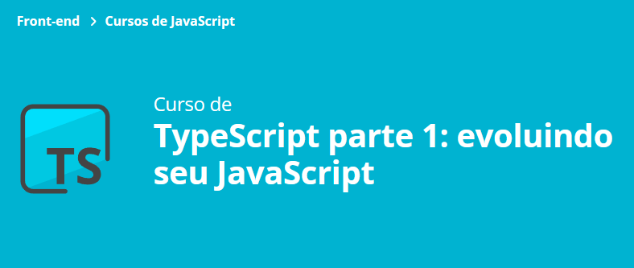

### Aula 1:
- Introdução ao projeto e sua estrutura; :white_check_mark:
- Um pouco sobre módulos do ECMASCRIPT; :white_check_mark:
- Modelagem de uma Negociação em Javascript; :white_check_mark:
- Buracos em nossa modelagem por limitações da linguagem Javascript. :white_check_mark:
### Aula 2:
- Download do TypeScript; :white_check_mark:
- Configuração do compilador e papel do tsconfig.json; :white_check_mark:
- Integração com scripts do Node.js; :white_check_mark:
- Modificadores de acesso private e public; :white_check_mark:
- Benefícios iniciais da linguagem TypeScript. :white_check_mark:
### Aula 3:
- O tipo implícito any; :white_check_mark:
- Benefícios da tipagem estática; :white_check_mark:
- Mais configurações do compilador tsc; :white_check_mark:
- Retorno de método explícito; :white_check_mark:
- Conversão de valores da interface do usuário. :white_check_mark:
### Aula 4:
- Modelagem da classe Negociações; :white_check_mark:
- Utilização de Generics; :white_check_mark:
- Revisão sobre encapsulamento; :white_check_mark:
- Questões de mutabilidade e como solucioná-la; :white_check_mark:
- O tipo ReadonlyArray; :white_check_mark:
- Adição de negociações em nossa lista. :white_check_mark:
### Aula 5 final:
- Nova maneira de declaração de array com generics; :white_check_mark:
- O tipo ReadonlyArray; :white_check_mark:
- O modificador readonly; :white_check_mark:
- Getters vs propriedades públicas em modo de leitura; :white_check_mark:
- Programação defensiva. :white_check_mark:

## 🔨 A saber sobre o curso
- Aprenda a configurar do zero seu ambiente
- Conheça gradativamente os recursos do TypeScript compiler
- Compreenda as vantagens da tipagem estática
- Modele suas classes utilizando o que há de melhor na linguagem
- Aprenda a utilizar tipos, modificadores, Generics entre outros

## ✔️ Técnicas e tecnologias utilizadas
- `HTML & CSS`
- `TypeScript`
- `JavaScript`
- `Bootstrap`

## 🛠️ Abrir e rodar o projeto
Para abrir e rodar o projeto, execute `npm i` para instalar as dependências e `npm run start` para iniciar o projeto.

## 📚 Mais informações do curso
Busque na plataforma da Alura o curso **TypeScript parte 1: evoluindo seu JavaScript** publicado na Escola Frontend.

 
